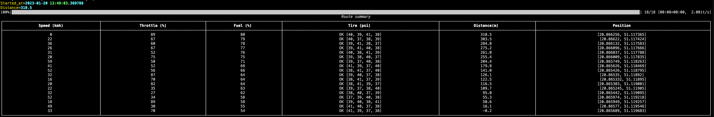

# Dummy Car GPS/OBD Datalogger

Simple app to generate fake car data from onboard datalogger. Build for purpose testing backend api for GPS/OBD device.

## Tech Stack

***Python:*** 3.10

***Dependencies:*** 
pytest,
requests,
obd
gps
scipy
osrm-py
rich
tqdm

## Usage/Examples

```bash
pip install -r requriments.txt
............
........
.....
...
.
python main.py

Enter start address (Country, City, Street)
Skarzysko-Kamienna, Plac Florianski 4, Poland
Enter end address (Country, City, Street)
Skarzysko-Kamienna, Gornicza 9, Poland
Started_at=2023-01-20 13:46:56.856834
Distance=462.4
100%|██████████| 23/23 [00:11<00:00,  2.00it/s]
                                 Route summary                                  
┏━━━━━━━━━━━━━┳━━━━━━━━━━━━━━┳━━━━━━━━━━┳━━━━━━━━━━━┳━━━━━━━━━━━━━┳━━━━━━━━━━━━┓
┃             ┃              ┃          ┃   Tire    ┃             ┃            ┃
┃ Speed (kmh) ┃ Throttle (%) ┃ Fuel (%) ┃   (psi)   ┃ Distance(m) ┃  Position  ┃
┣━━━━━━━━━━━━━╋━━━━━━━━━━━━━━╋━━━━━━━━━━╋━━━━━━━━━━━╋━━━━━━━━━━━━━╋━━━━━━━━━━━━┫
┃      0      ┃      86      ┃    80    ┃  OK [39,  ┃    462.4    ┃ [20.86625… ┃
┃             ┃              ┃          ┃  40, 37,  ┃             ┃ 51.117365] ┃
┃             ┃              ┃          ┃    41]    ┃             ┃            ┃
┃     22      ┃      32      ┃    79    ┃  OK [39,  ┃    455.4    ┃ [20.86622, ┃
┃             ┃              ┃          ┃  37, 40,  ┃             ┃ 51.117424] ┃
┃             ┃              ┃          ┃    41]    ┃             ┃            ┃
┃     36      ┃      60      ┃    78    ┃  OK [40,  ┃    436.7    ┃ [20.86613… ┃
┃             ┃              ┃          ┃  38, 39,  ┃             ┃ 51.117583] ┃
┃             ┃              ┃          ┃    41]    ┃             ┃            ┃
┃     26      ┃      62      ┃    77    ┃  OK [41,  ┃    427.1    ┃ [20.86609… ┃
┃             ┃              ┃          ┃  37, 39,  ┃             ┃ 51.117666] ┃
┃             ┃              ┃          ┃    40]    ┃             ┃            ┃
┃     38      ┃      44      ┃    75    ┃  OK [37,  ┃    406.2    ┃ [20.86634… ┃
┃             ┃              ┃          ┃  39, 40,  ┃             ┃ 51.117773] ┃
┃             ┃              ┃          ┃    38]    ┃             ┃            ┃
┃     68      ┃      27      ┃    69    ┃  OK [38,  ┃    328.6    ┃ [20.86725… ┃
┃             ┃              ┃          ┃  39, 40,  ┃             ┃ 51.118171] ┃
┃             ┃              ┃          ┃    41]    ┃             ┃            ┃
┃     26      ┃      58      ┃    68    ┃  OK [41,  ┃    318.8    ┃ [20.86736… ┃
┃             ┃              ┃          ┃  37, 39,  ┃             ┃ 51.118219] ┃
┃             ┃              ┃          ┃    38]    ┃             ┃            ┃
┃     37      ┃      80      ┃    66    ┃  OK [39,  ┃    299.2    ┃ [20.8676,  ┃
┃             ┃              ┃          ┃  38, 41,  ┃             ┃ 51.118319] ┃
┃             ┃              ┃          ┃    40]    ┃             ┃            ┃
┃     24      ┃      44      ┃    65    ┃  OK [38,  ┃    290.9    ┃ [20.86770… ┃
┃             ┃              ┃          ┃  40, 39,  ┃             ┃ 51.118348] ┃
┃             ┃              ┃          ┃    41]    ┃             ┃            ┃
┃     23      ┃      87      ┃    65    ┃  OK [39,  ┃    283.5    ┃ [20.86780… ┃
┃             ┃              ┃          ┃  37, 38,  ┃             ┃ 51.118374] ┃
┃             ┃              ┃          ┃    41]    ┃             ┃            ┃
┃     17      ┃      89      ┃    64    ┃  OK [37,  ┃    279.2    ┃ [20.86786… ┃
┃             ┃              ┃          ┃  38, 40,  ┃             ┃ 51.118387] ┃
┃             ┃              ┃          ┃    41]    ┃             ┃            ┃
┃     17      ┃      34      ┃    64    ┃  OK [37,  ┃    274.8    ┃ [20.86792… ┃
┃             ┃              ┃          ┃  38, 39,  ┃             ┃  51.1184]  ┃
┃             ┃              ┃          ┃    41]    ┃             ┃            ┃
┃     27      ┃      80      ┃    63    ┃  OK [38,  ┃    264.2    ┃ [20.86806… ┃
┃             ┃              ┃          ┃  41, 39,  ┃             ┃ 51.118432] ┃
┃             ┃              ┃          ┃    40]    ┃             ┃            ┃
┃     46      ┃      58      ┃    61    ┃  OK [40,  ┃    233.4    ┃ [20.86848… ┃
┃             ┃              ┃          ┃  41, 37,  ┃             ┃ 51.118525] ┃
┃             ┃              ┃          ┃    38]    ┃             ┃            ┃
┃     26      ┃      28      ┃    60    ┃  OK [37,  ┃    223.4    ┃ [20.86861… ┃
┃             ┃              ┃          ┃  38, 41,  ┃             ┃ 51.118555] ┃
┃             ┃              ┃          ┃    40]    ┃             ┃            ┃
┃     52      ┃      79      ┃    56    ┃  OK [41,  ┃    183.3    ┃ [20.86915… ┃
┃             ┃              ┃          ┃  38, 39,  ┃             ┃ 51.118675] ┃
┃             ┃              ┃          ┃    40]    ┃             ┃            ┃
┃     30      ┃      83      ┃    55    ┃  OK [40,  ┃    170.2    ┃ [20.86933… ┃
┃             ┃              ┃          ┃  39, 38,  ┃             ┃ 51.118714] ┃
┃             ┃              ┃          ┃    37]    ┃             ┃            ┃
┃     23      ┃      33      ┃    55    ┃  OK [41,  ┃    162.8    ┃ [20.86942… ┃
┃             ┃              ┃          ┃  40, 37,  ┃             ┃ 51.118746] ┃
┃             ┃              ┃          ┃    38]    ┃             ┃            ┃
┃     22      ┃      56      ┃    54    ┃  OK [38,  ┃    155.8    ┃ [20.86951… ┃
┃             ┃              ┃          ┃  40, 37,  ┃             ┃ 51.118776] ┃
┃             ┃              ┃          ┃    39]    ┃             ┃            ┃
┃     68      ┃      88      ┃    45    ┃  OK [37,  ┃    52.5     ┃ [20.87089… ┃
┃             ┃              ┃          ┃  41, 38,  ┃             ┃ 51.119097] ┃
┃             ┃              ┃          ┃    40]    ┃             ┃            ┃
┃     15      ┃      26      ┃    45    ┃  OK [40,  ┃    49.3     ┃ [20.87094, ┃
┃             ┃              ┃          ┃  38, 37,  ┃             ┃ 51.119107] ┃
┃             ┃              ┃          ┃    41]    ┃             ┃            ┃
┃     48      ┃      37      ┃    42    ┃  OK [41,  ┃    15.4     ┃ [20.87110… ┃
┃             ┃              ┃          ┃  38, 37,  ┃             ┃ 51.119393] ┃
┃             ┃              ┃          ┃    40]    ┃             ┃            ┃
┃     32      ┃      48      ┃    41    ┃  OK [38,  ┃     0.1     ┃ [20.87113… ┃
┃             ┃              ┃          ┃  40, 39,  ┃             ┃ 51.11953]  ┃
┃             ┃              ┃          ┃    37]    ┃             ┃            ┃
┗━━━━━━━━━━━━━┻━━━━━━━━━━━━━━┻━━━━━━━━━━┻━━━━━━━━━━━┻━━━━━━━━━━━━━┻━━━━━━━━━━━━┛
```


## Screenshot
